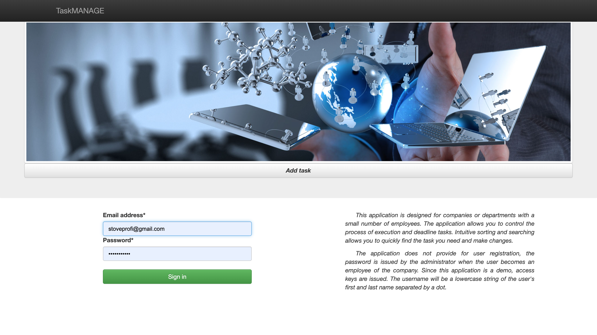
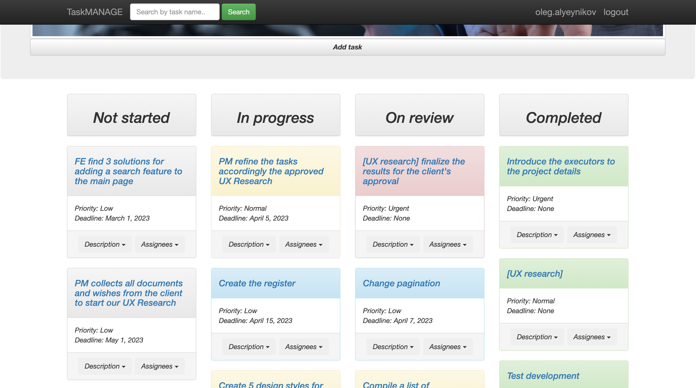
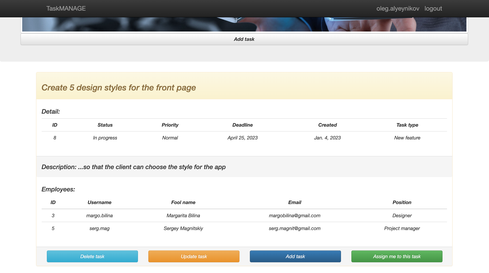

# Task Manager

Django project for managing tasks for small companies or departments.

## Description

This application is designed for companies or departments with a small number of employees. 
The application allows you to control the process of execution and deadline tasks. 
Intuitive sorting and searching will enable you to quickly find the required task and make changes.

The application does not provide for user registration, 
the password is issued by the administrator when the user becomes an employee of the company. 
Since this application is a demo, access keys are issued. 
The username will be a lowercase string of the user's first and last name separated by a dot.

## Check it out!

"""the project is being developed"""

## Features

* Intuitive website interface
* Easy task management
* Easy search for tasks by name
* User's personal account with the tasks in which he participates
* Powerful admin panel for advanced management

## Demo

## Installation

Python3 must be already installed

* git clone https://github.com/AlenOl/task-manager

For Mac:

* cd task-manager
* python3 -m venv venv
* source venv/bin/activate
* pip install -r requirements.txt
* python manage.py runserver

For Windows:

* cd task-manager
* pip install virtualenv venv
* venv\Scripts\activate
* pip install -r requirements.txt
* python manage.py runserver
