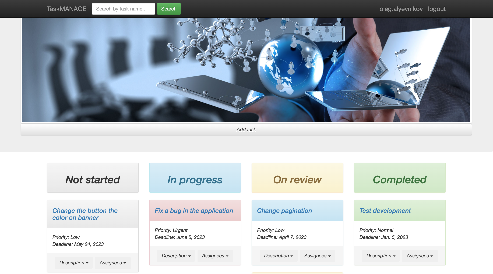

# Task Manager

Django project for managing tasks for small company or department.

## Check it out!

"""the project is being developed"""

## Features

* Intuitive website interface
* Easy task management
* Easy search for tasks by name
* User's personal account with the tasks in which he participates
* Powerful admin panel for advanced management

## Demo

## Installation

Python3 must be already installed

* git clone https://github.com/AlenOl/task-manager

For Mac:

* cd task-manager
* python3 -m venv venv
* source venv/bin/activate
* pip install -r requirements.txt
* python manage.py runserver

For Windows:

* cd task-manager
* pip install virtualenv venv
* venv\Scripts\activate
* pip install -r requirements.txt
* python manage.py runserver
